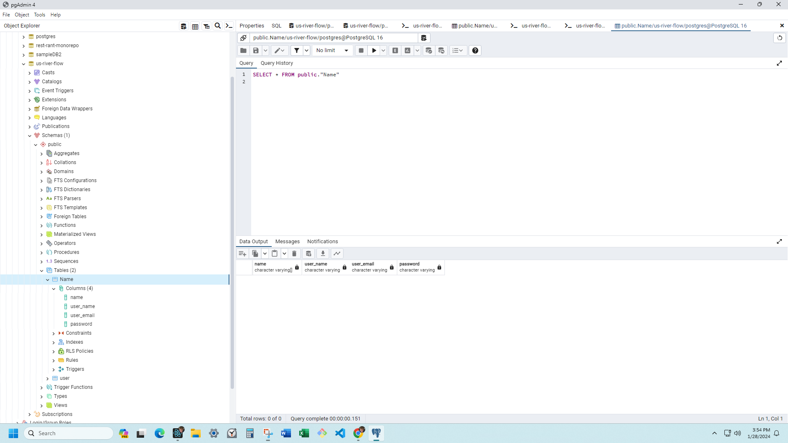

 # **US River Currents Flow Map** #

## _Milestone Project 3:  US River Currents Flow Map_ ##

Created by Danna Bohnhoff

Features:
1. Interactive Map Interface
2. River Names and Labels
3. Search Functional
4. Legend
5. Mobile Responsiveness
6. Filtering Options
7. Map Layers
8. Help Section

GitHub Repository:  https://github.com/danna202/river-flow-direction-app.git

This site was Deployed using [River-Flow_Direction](river-flow-direction-app.vercel.app).

How to Use:

This application utilizes the Streamer Trace API to display the directional flow of rivers in the United States. By selecting a specific river or stream, users can view the direction in which the river flows towards the sea into which it empties.

traceable streams of US:
https://txpub.usgs.gov/DSS/Streamer/api/3.14/web/samples/thumbs/sample05_thumb.png

